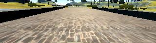

# Behavioral_Cloning_Project : Predicting Steering Angles from Captured By Camera 

This project performs behavioral cloning, training an AI agent to mimic human driving behavior in a simulator. Using the vehicle's camera images collected from the human demonstration, we train a deep neural network to predict the vehicle's steering angle.  

The final trained model is tested on the same test track that was run during the human demonstration.

# Objective Of The Project

- Use the simulator to collect data of good driving behavior
- Design, train and validate a model that predicts a steering angle from image data
- Use the model to drive the vehicle autonomously around the first track in the simulator. The vehicle should remain on the road for an entire loop around the track.
- Summarize the results with a written report

# Dependencies

- Python 3.10 / 3.7
- TensorFlow
- Keras
- PIL
- Numpy
- h5py
- Scikit Learn
- Pandas
- OpenCV
- Matplotlib (Optional)
- Udacity behavioral cloning simulator

# Project Stepts :

- step 1 : Collecting data ( from the human demonstration) using simulator for good driving behavior
- step 2 : Load The data
- step 3 : Split data into trainig and validation sets
- step 4 : Define a generator function to be used through training
- step 5 : Use the defined generator for training set and validation set
- step 6 :  Using keras, build a regression model based on nvidia architecture  to predict the steering angle

# My Project Includes The Following Files 

- <a href= "Behavioral_Cloning_Project.ipynb">Behavioral_Cloning_Project.ipynb</a> containing the script to create and train the model
- <a href= "drive.py"> drive.py </a>for driving the car in autonomous mode
- <a href= "model.h5">model.h5</a> containing a trained convolution neural network
- <a href= "video.py">video.py</a> a script that can be used to make a video of the vehicle when it is driving autonomously
- <a href= "README.md">README.md</a> summarizing the results
- images folder contains the sample images

# Simulator Download

- <a href="https://d17h27t6h515a5.cloudfront.net/topher/2017/February/58ae46bb_linux-sim/linux-sim.zip">Linux</a>
- <a href="https://d17h27t6h515a5.cloudfront.net/topher/2017/February/58ae4594_mac-sim.app/mac-sim.app.zip">Mac</a>
- <a href="https://d17h27t6h515a5.cloudfront.net/topher/2017/February/58ae4419_windows-sim/windows-sim.zip">Windows</a>

During training, the human demonstrator drives the vehicle using his/her keyboard, as in a video game:

When you first run the simulator, you’ll see a configuration screen asking what size and graphical quality you would like. We suggest running at the smallest size and the fastest graphical quality.
We also suggest closing most other applications (especially graphically intensive applications) on your computer, so that your machine can devote its resources to running the simulator.

# How to Run the Model

The neural network model needed to be built into the python program file **«model.py»**. When this program was launched; needed to save the model to the **«model.h5»** file. This saved neural network model can then be invoked to run Car Simulator by running the command **«python drive.py model.h5»**. A helper file **«drive.py»** was provided by Udacity that we could modify; if we needed.

For data collection; the following procedure must be followed: When the car drives through the simulator in «Training» mode; it saves the images in **the IMG folder** and the details of the images are stored in **the driving_log.csv file**. The drving_log.csv file has 7 columns; in the following order: Middle camera image file name, Left camera image file name, Right camera image file name, Steering , Throttle , Brake and Speed. Build a model; we could use either only the image from the central camera or from all three cameras. In the output, only the Steering value was relevant for this project; Throttle, brake and speed values were ignored.

The file **«video.py»** was created from the dataset using the command **«python video.py run1»**; where «run1» is the folder where the dataset is stored.

**Why create a video**

- It's been noted the simulator might perform differently based on the hardware. So if your model drives succesfully on your machine it might not on another machine (your reviewer). Saving a video is a solid backup in case this happens.
- You could slightly alter the code in drive.py and/or video.py to create a video of what your model sees after the image is processed (may be helpful for debugging).

# Data Collection, Preprocessing, and Augmentation

**Collecting Training Data :**

In order to start collecting training data, you'll need to do the following:

1. Enter Training Mode in the simulator.
2. Start driving the car to get a feel for the controls.
3. When you are ready, hit the record button in the top right to start recording.
4. Continue driving for a few laps or till you feel like you have enough data.
5. Hit the record button in the top right again to stop recording.

**Strategies for Collecting Data :**

- the car should stay in the center of the road as much as possible
- if the car veers off to the side, it should recover back to center
- driving counter-clockwise can help the model generalize
- flipping the images is a quick way to augment the data
- collecting data from the second track can also help generalize the model
- we want to avoid overfitting or underfitting when training the model
- knowing when to stop collecting more data

The following figure shows an example I have collected during the training time :

 **Dataset Statistics :**
 
The dataset consists of 24108 images:

- 8036 images per camera angle
- 6428 train samples
- 1608 validation samples

The training track has a lot of shallow bends and straight lines. As a result, the majority of recorded steering angles are zero. Therefore, image preprocessing and corresponding steering angles are needed to generalize the training model to unseen tracks, such as our validation track.

**Data Preprocessing :**

In Keras, lambda layers can be used to create arbitrary functions that operate on each image as it passes through the layer.It will ensure that the model will normalize input images when making predictions in **drive.py**.

That lambda layer could take each pixel in an image and run it through the formulas:

**pixel_normalized = pixel / 255**

**pixel_mean_centered = pixel_normalized - 0.5  (to get resulting values between -1 and +1)**

A lambda layer will look something like:

**Lambda(lambda x: (x / 255.0) - 0.5)**

**Data Augmentation :**

Augment the data by flipping the images (use OpenCV flip function) and multiply measurements by -1.0 (taking the opposite sign of the steering measurement). 

The idea behind this operation is left turning bends are more prevalent than right bends in the training track. Hence, in order to increase the generalization of our mode. we flip images and respective steering angles

**Normal image from the center camera**

**Flipped image from the center camera**

**Cropping Images :**

The cameras in the simulator capture 160 pixel by 320 pixel images.

Not all of these pixels contain useful information, however. In the image above, the top portion of the image captures trees and hills and sky, and the bottom portion of the image captures the hood of the car.

So in order to make the model train faster, i   cropped  each image to focus on only the portion of the image that is useful for predicting a steering angle.

Keras provides **the Cropping2D** layer for image cropping within the model. This is relatively fast, because the model is parallelized on the GPU, so many images are cropped simultaneously.

By contrast, image cropping outside the model on the CPU is relatively slow.

Also, by adding the cropping layer, the model will automatically crop the input images when making predictions in drive.py.

I used the Cropping2D layer to crop the images; about 70 top pixels of the image is the scenery (trees, mountains, etc.) and about 25 bottom pixels of the image is the hood of the car

Here is an example of an input image and its cropped version after passing through a Cropping2D layer:

**Original image taken from the simulator**

**Cropped image after passing through a Cropping2D layer**

# Using Multiple Cameras 

**Explanation of How Multiple Cameras Work**

The image below gives a sense for how multiple cameras are used to train a self-driving car. This image shows a bird's-eye perspective of the car. The driver is moving forward but wants to turn towards a destination on the left.

From the perspective of the left camera, the steering angle would be less than the steering angle from the center camera. From the right camera's perspective, the steering angle would be larger than the angle from the center camera. The next section will discuss how this can be implemented in your project although there is no requirement to use the left and right camera images.

**Angles between the destination and each camera**

Use left and right camera images in addition to the center camera image. File names of left and right camera images are in columns 2 and 3 respectively in the driving_log.csv file. Adjust the left camera and right camera steering measurements by a correction coefficient; so that the left camera measurement will be (measurement+coefficient) and the right camera measurement will be (measurement-coefficient); the center camera image steering measurement need not be corrected. After trial and error; I arrived at a correction coefficient of 0.2
